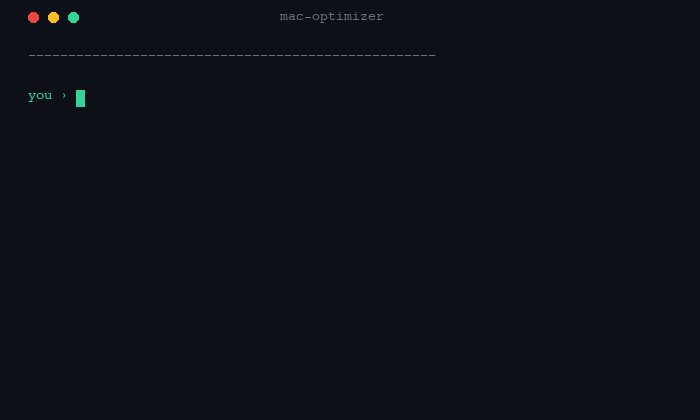

# Mac Optimizer — Claude Code Plugin

**Free up space on your Mac by chatting with Claude. No commands, no configuration.**

Libera espaço no seu Mac conversando com Claude. Sem comandos, sem configuração.



---

## Install / Instalar

Paste in your terminal and press Enter:

Cole no terminal e pressione Enter:

```bash
mkdir -p ~/.claude/commands && curl -fsSL https://raw.githubusercontent.com/tadeurosa-ai/mac-optimizer/main/optimizer.md -o ~/.claude/commands/optimizer.md && echo "✓ /optimizer installed"
```

---

## How to use / Como usar

Open Claude Code and type:

```
/optimizer
```

That's it. Claude scans, asks questions, you answer. Nothing else.

---

## What it does / O que faz

- Scans system caches (`~/Library/Caches`)
- Finds unnecessary `.dmg` and `.pkg` installers
- Detects Application Support folders from removed apps
- Analyzes unnecessary LaunchAgents and daemons
- Identifies local Time Machine snapshots
- Asks before deleting anything questionable
- 30-day quarantine — recoverable if you change your mind
- Executes cleanup with your approval

## Requirements / Requisitos

- macOS 12+
- Claude Code with Pro or Max plan

---

## Real results / Resultados reais

| Session | Space freed |
|---------|------------|
| Old Mac — before migrating to new machine | **43 GB** |
| Post-install test (Apr 17, 2026) | 2.6 GB |

---

If it worked, leave a star — helps the project reach more people.

Se funcionou, deixa uma estrela. Ajuda o projeto a chegar em mais gente.
